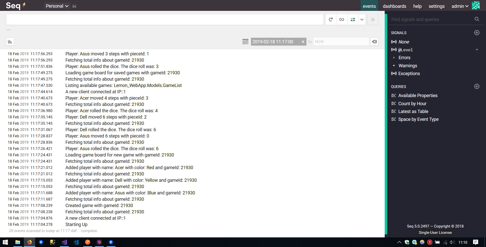

## Implementation av loggning

Vi använder oss av Serilog för att logga händelserna i applikationen. Initieringen av Serilog sker i Startup.cs.
Vi har använt oss av mjukvaran SEQ för att se loggningens händelseförlopp. Bild nedanför visar implementationen och även vilken typ av data vi loggar.

*Serilog/SEQ*