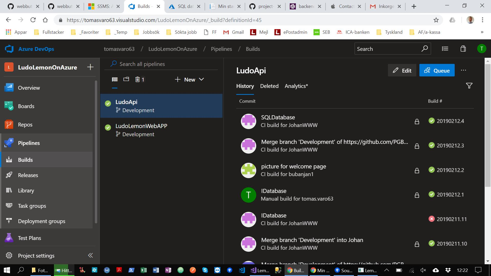
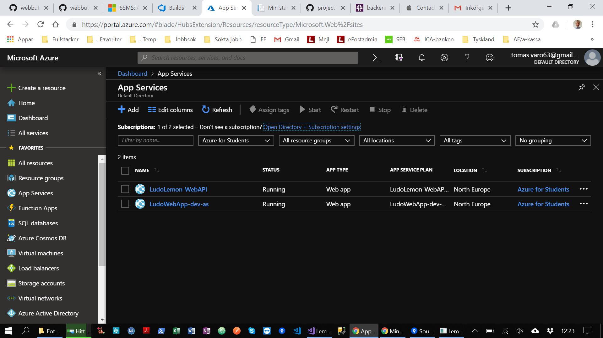
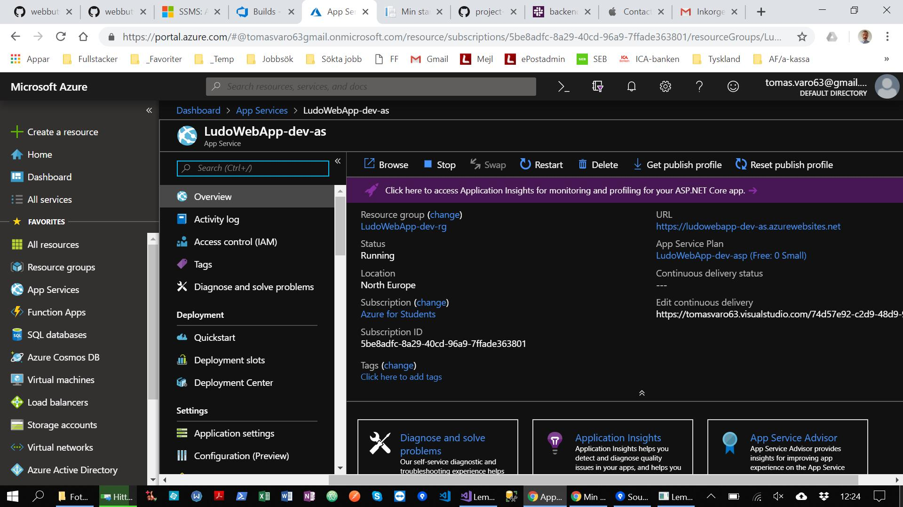
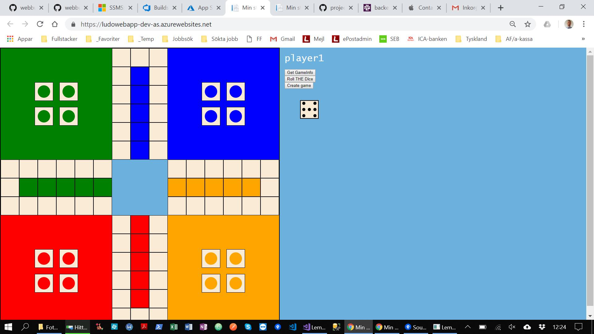

## CI/CD vi Azure DevOps

I Azure DevOps skapade vi två pipelines. En till LudoWebApp som innehåller api't och game-engine och en till Lemon-WebApp som innehåller webb-applikation. Genom att deploya till webserver på Azure så kan vi ha api och game-engine ständingt igång och köra webb-applikationen mot den. Spelet går även att spela på webservern via länken: https://ludowebapp-dev-as.azurewebsites.net/

*Pipelines i Azure DevOps*

*App Servicies i Azure*

*LudoWebApp App Service*

*Lemon Ludo spelet via webservern*
