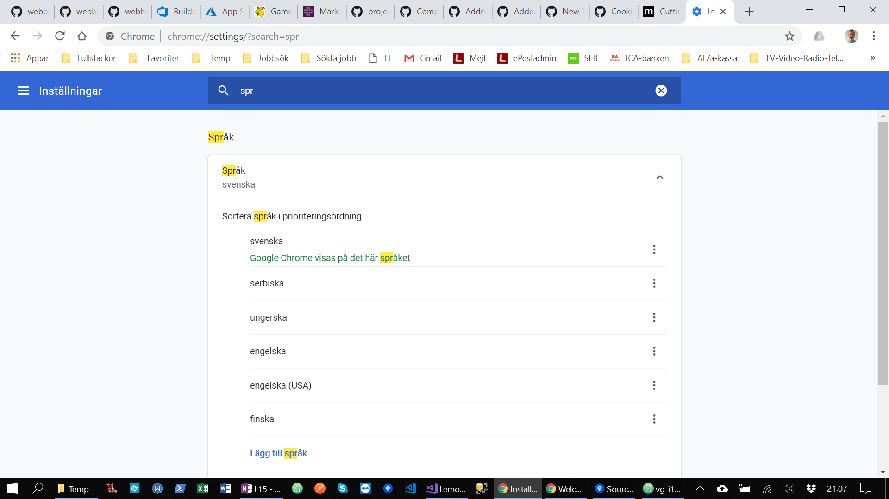
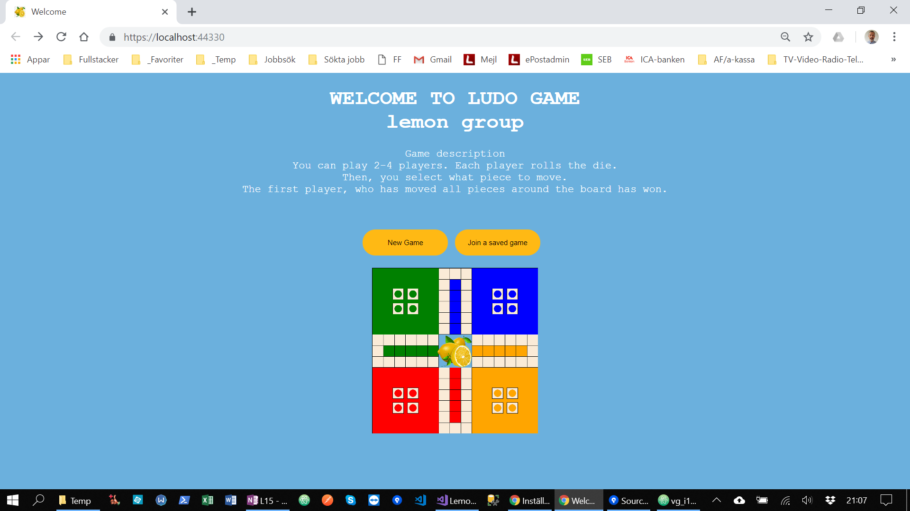
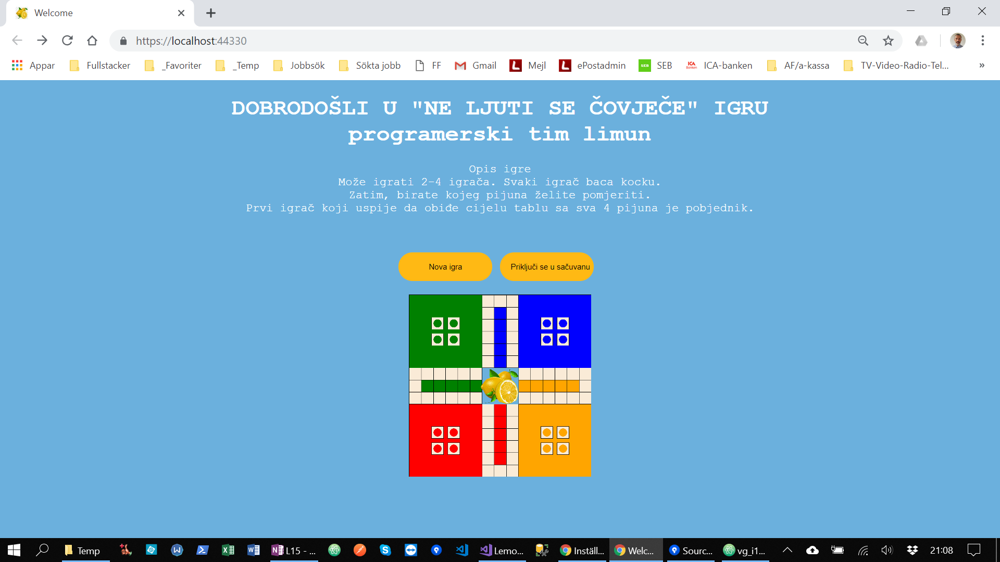
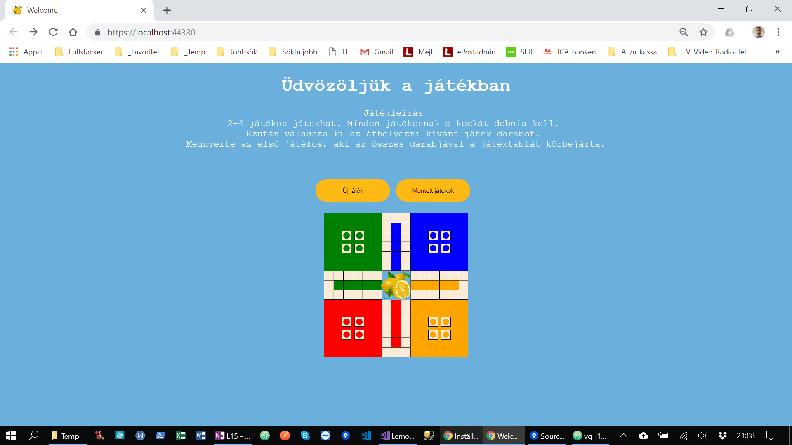
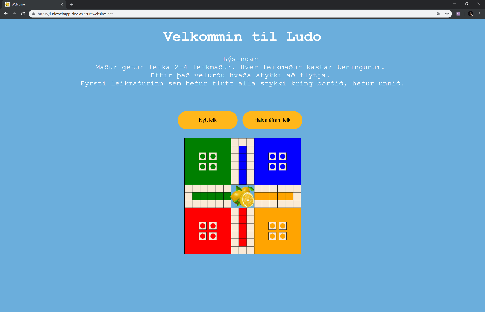

# Internationalisering

Vi har lagt in stöd för **flera språk** till vår Ludo applikation. Beroende på användarens förval av språk i Webbläsar så anpassas språket i Ludo-spelet automatiskt efter det. Saknas språkstöd för aktuellt språk så blir engelska valt som default.

För närvarande har vi språkstöd för:
* engelska
* svenska
* finska
* serbiska
* ungerska
* isländska

Vi har åstadkommit språkstödet genom implementering av L10n (Localization) i vårat program.

Vi hade även tänkt lägga in en knapp för att aktivt kunna välja språket i spelet men vi hann tyvärr inte med det.

*Språkinställning i Webbläsaren*

*Språkstöd för svenska*

*Språkstöd för engelska*

*Språkstöd för finska*

*Språkstöd för serbiska*

*Språkstöd för ungerska*

*Språkstöd för isländska*
